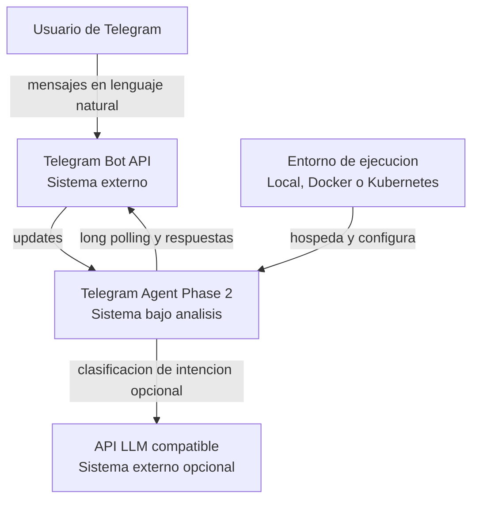

# 01. System Context

## Objetivo del sistema

El sistema permite que un usuario interactue con un bot de Telegram usando lenguaje natural para consultar el estado de un proyecto agile y crear tareas nuevas sin depender exclusivamente de comandos rigidos.

## Responsabilidad principal

- recibir mensajes desde Telegram
- interpretar mensajes como intenciones estructuradas
- consultar o modificar informacion del workspace del proyecto
- responder con contexto operativo real

## Fuera de alcance actual

- ejecucion autonoma de acciones fuera del dominio modelado
- acceso directo del LLM a bases de datos o repositorios
- persistencia durable del workspace
- multi-tenant real por equipo, usuario o chat
- API REST de negocio separada

## Personas y sistemas externos

### Persona primaria

- Usuario de Telegram: solicita consultas o acciones con frases como `que tareas tiene ana`, `como va el sprint actual` o `crea una tarea para revisar login`.

### Sistemas externos principales

- Telegram Bot API: entrega updates y enruta respuestas del bot.
- API LLM compatible con `chat/completions`: interpreta el mensaje cuando el modo AI esta habilitado.

### Sistemas de soporte operativo

- Entorno de ejecucion: proceso local Java, contenedor Docker o pod en Kubernetes.
- Configuracion externa: propiedades, variables de entorno y secretos.

## Diagrama C1

## Interacciones clave

1. El usuario envia una solicitud libre desde Telegram.
2. El bot consulta updates por long polling.
3. La aplicacion transforma el mensaje en una intencion estructurada.
4. El orquestador ejecuta herramientas del dominio segun esa intencion.
5. El bot devuelve un resumen o confirmacion al usuario.

## Requerimientos funcionales implicitos en el codigo

- Mostrar ayuda.
- Listar todas las tareas.
- Filtrar tareas por responsable.
- Filtrar tareas por estado.
- Crear tarea desde lenguaje natural.
- Resumir el sprint actual.
- Resumir la carga del equipo por story points.
- Pedir aclaracion si falta informacion.

## Requerimientos no funcionales observables

- degradacion controlada cuando el LLM no esta disponible
- separacion entre interpretacion y ejecucion
- externalizacion de configuracion y secretos
- arranque simple para entornos locales y de laboratorio

## Hallazgos importantes

- El LLM solo clasifica intenciones; no ejecuta operaciones del dominio.
- Existe un fallback local rule-based cuando AI esta deshabilitado o falla.
- El sistema sigue siendo un monolito pedagogico, pero con un pipeline interno de agente claramente identificable.
