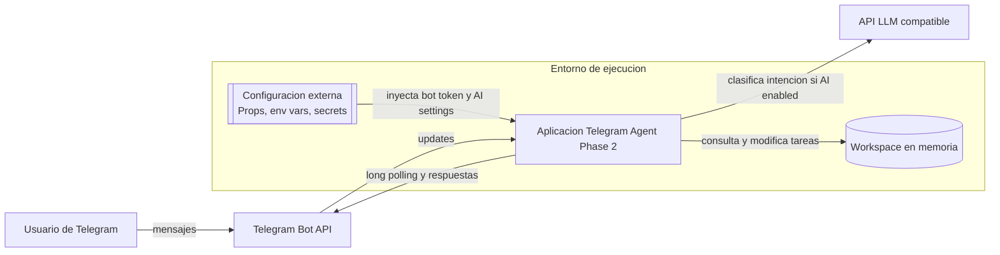
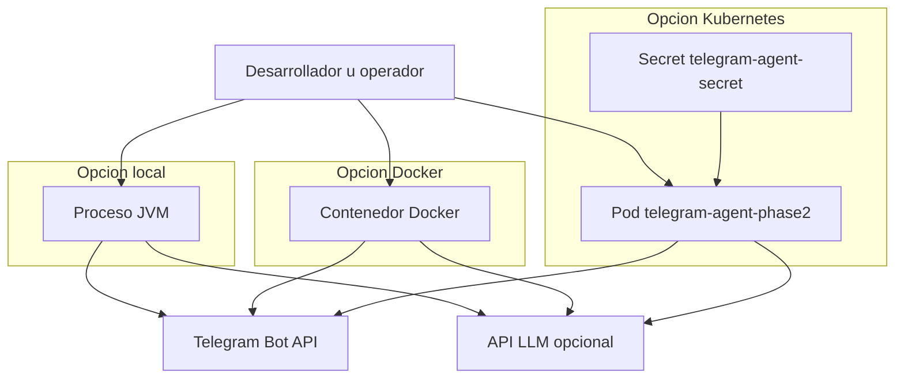

# 02. Container View

## Contenedores identificados

Aunque el proyecto se despliega como una sola aplicacion, la solucion incluye varios contenedores logicos y sistemas participantes.

### 1. Aplicacion Telegram Agent Phase 2

- Tipo: aplicacion Spring Boot empaquetada como jar.
- Tecnologia: Java 17, Spring Boot 3.3.5.
- Responsabilidad: recibir mensajes, orquestar interpretacion de intenciones, ejecutar herramientas del dominio y responder al usuario.

### 2. Telegram Bot API

- Tipo: sistema externo.
- Tecnologia: integracion via libreria Telegram Bots.
- Responsabilidad: entregar updates y distribuir respuestas.

### 3. API LLM compatible

- Tipo: sistema externo opcional.
- Tecnologia: endpoint HTTP compatible con `chat/completions`.
- Responsabilidad: transformar mensajes en JSON con intencion estructurada.

### 4. Workspace store en memoria

- Tipo: almacenamiento embebido.
- Tecnologia: `CopyOnWriteArrayList<TaskItem>` y objetos de dominio en proceso.
- Responsabilidad: almacenar tareas demo, sprint actual y metricas simples de carga.

### 5. Configuracion y secretos

- Tipo: fuente de configuracion externa.
- Tecnologia: `application.properties`, variables de entorno y secretos Kubernetes.
- Responsabilidad: proveer credenciales de Telegram y AI, ademas del modelo y endpoint.

## Diagrama C2

## Relaciones entre contenedores

### Aplicacion -> Telegram

- Patron: long polling saliente.
- Motivo: no requiere exponer callbacks HTTP publicos.

### Aplicacion -> API LLM

- Patron: request/response HTTP.
- Motivo: obtener una estructura de intencion a partir de lenguaje natural.
- Contingencia: si falla, se usa parser local.

### Aplicacion -> Workspace en memoria

- Patron: invocacion interna via interfaz `ProjectWorkspaceService`.
- Motivo: desacoplar orquestacion del origen de datos.

### Configuracion -> Aplicacion

- Patron: configuration binding de Spring Boot.
- Motivo: externalizar tokens, feature flag de AI y modelo.

## Diagrama de despliegue simplificado

## Observaciones de capacidad

- El `Deployment` usa `replicas: 1`, consistente con el store local en memoria.
- Escalar horizontalmente hoy fragmentaria el workspace entre replicas.
- En modo AI, la latencia total depende tambien del proveedor LLM.
