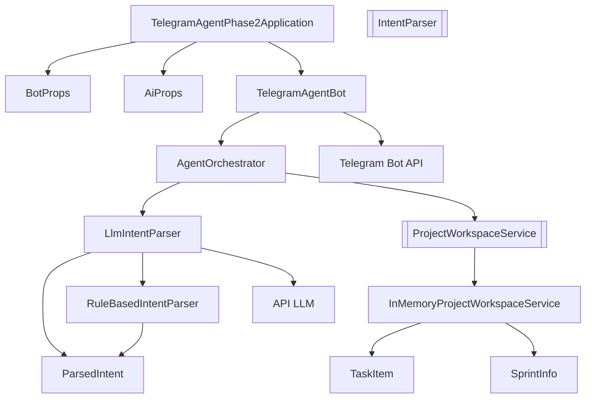

# 03. Component View

## Componentes internos principales

La aplicacion organiza el flujo en componentes de infraestructura, interpretacion y herramientas del dominio.

### `TelegramAgentPhase2Application`

- Rol: bootstrap.
- Responsabilidad: iniciar Spring Boot y habilitar `BotProps` y `AiProps`.

### `BotProps`

- Rol: configuracion de Telegram.
- Responsabilidad: mapear nombre y token del bot.

### `AiProps`

- Rol: configuracion del parser AI.
- Responsabilidad: mapear flag `enabled`, `baseUrl`, `apiKey`, `model` y `timeoutSeconds`.

### `TelegramAgentBot`

- Rol: adaptador de entrada y salida con Telegram.
- Responsabilidad:
  - consumir `Update`
  - descartar mensajes no textuales
  - delegar al `AgentOrchestrator`
  - enviar respuesta al chat

### `AgentOrchestrator`

- Rol: capa de aplicacion del agente.
- Responsabilidad:
  - solicitar una `ParsedIntent`
  - resolver aclaraciones
  - ejecutar herramientas del dominio
  - construir respuestas textuales finales

### `IntentParser`

- Rol: puerto de interpretacion.
- Responsabilidad: abstraer la transformacion de texto a `ParsedIntent`.

### `LlmIntentParser`

- Rol: adaptador AI.
- Responsabilidad:
  - decidir si AI esta habilitado
  - invocar un endpoint `chat/completions`
  - parsear JSON devuelto por el modelo
  - usar fallback local si algo falla

### `RuleBasedIntentParser`

- Rol: fallback deterministico.
- Responsabilidad:
  - detectar intenciones con heuristicas y regex
  - extraer campos como responsable y story points
  - pedir aclaracion para casos ambiguos

### `ProjectWorkspaceService`

- Rol: puerto de herramientas del dominio.
- Responsabilidad: exponer consultas y acciones sobre tareas, sprint actual y carga del equipo.

### `InMemoryProjectWorkspaceService`

- Rol: adaptador de datos demo.
- Responsabilidad:
  - sembrar datos iniciales
  - listar y filtrar tareas
  - crear tareas nuevas
  - resumir carga por responsable

### `ParsedIntent`, `IntentType`, `TaskItem`, `SprintInfo`

- Rol: modelos de transporte y dominio.
- Responsabilidad: representar intenciones, enumeracion de acciones, tareas y sprint.

## Diagrama C3

## Flujo interno de responsabilidades

1. Spring crea el contexto y registra configuracion.
2. `TelegramAgentBot` recibe un texto desde Telegram.
3. `AgentOrchestrator` solicita una intencion a `LlmIntentParser`.
4. `LlmIntentParser` usa AI o fallback local segun configuracion y errores.
5. El orquestador decide que operacion ejecutar sobre `ProjectWorkspaceService`.
6. El resultado del dominio se transforma en texto final.
7. `TelegramAgentBot` envia la respuesta al usuario.

## Tabla de dependencias

| Componente | Depende de | Tipo de dependencia | Razon |
|---|---|---|---|
| `TelegramAgentBot` | `BotProps` | configuracion | obtener token del bot |
| `TelegramAgentBot` | `AgentOrchestrator` | aplicacion | resolver solicitud del usuario |
| `AgentOrchestrator` | `LlmIntentParser` | interpretacion | obtener intencion estructurada |
| `AgentOrchestrator` | `ProjectWorkspaceService` | dominio | ejecutar consultas y acciones |
| `LlmIntentParser` | `AiProps` | configuracion | habilitar y parametrizar AI |
| `LlmIntentParser` | `RuleBasedIntentParser` | fallback | degradacion controlada |
| `InMemoryProjectWorkspaceService` | `TaskItem`, `SprintInfo` | dominio | representar estado del workspace |

## Mapeo intencion -> operacion

| Intencion | Coordinador | Operacion | Respuesta |
|---|---|---|---|
| `HELP` | `AgentOrchestrator` | ninguna | ejemplos de uso |
| `LIST_TASKS` | `AgentOrchestrator` | `findAllTasks()` | lista completa |
| `LIST_TASKS_BY_ASSIGNEE` | `AgentOrchestrator` | `findTasksByAssignee()` | lista filtrada |
| `LIST_TASKS_BY_STATUS` | `AgentOrchestrator` | `findTasksByStatus()` | lista filtrada |
| `CREATE_TASK` | `AgentOrchestrator` | `createTask()` | confirmacion con detalle |
| `CURRENT_SPRINT_SUMMARY` | `AgentOrchestrator` | `getCurrentSprint()` y `findAllTasks()` | resumen del sprint |
| `TEAM_LOAD_SUMMARY` | `AgentOrchestrator` | `storyPointsByAssignee()` | ranking de carga |
| `UNKNOWN` | `AgentOrchestrator` | ninguna | mensaje de ayuda |

## Observaciones de diseño

- El proyecto ya muestra un patron de agente, aunque controlado y seguro.
- La interfaz `IntentParser` existe, pero el orquestador hoy depende concretamente de `LlmIntentParser`.
- El store demo modela un workspace de equipo y no una vista por chat o usuario.
