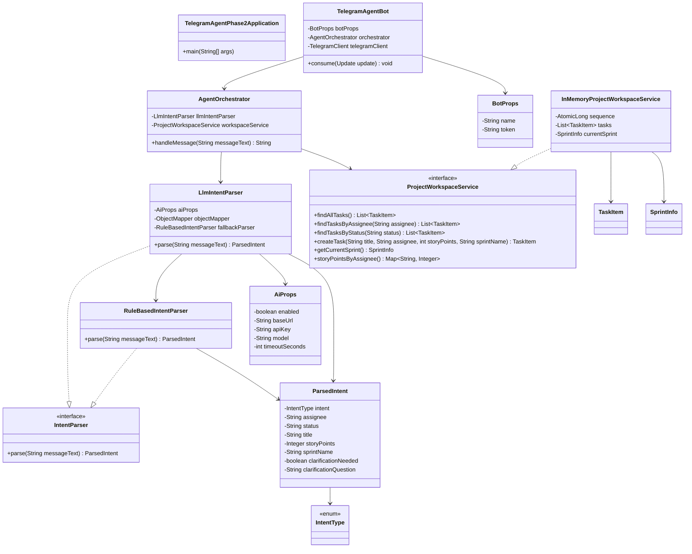
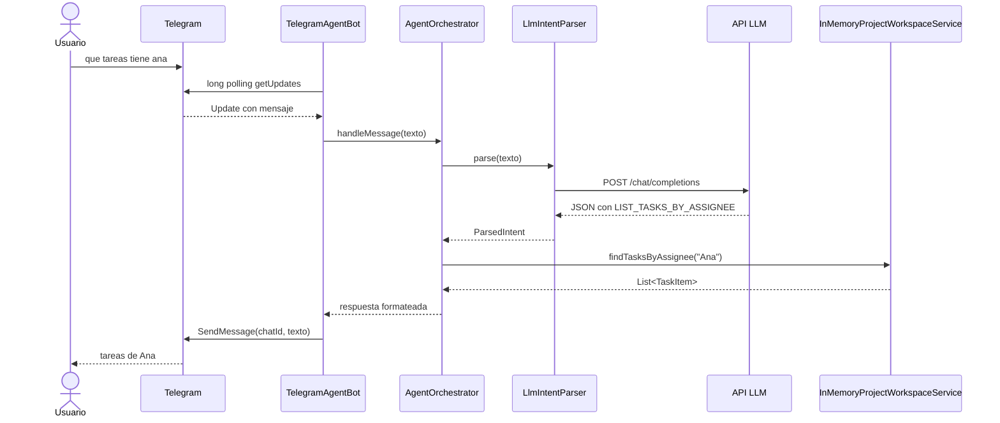
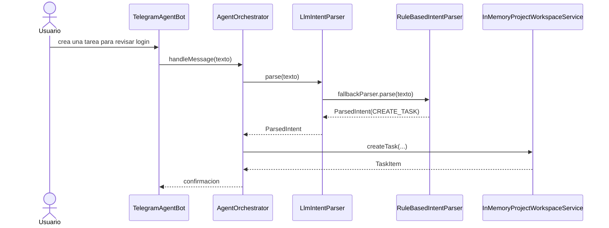

# 04. Code View

## Vista de codigo

Este nivel muestra las clases principales y como colaboran para convertir un mensaje libre en una accion concreta del dominio.

## Diagrama de clases

## Diagrama de secuencia: consulta con LLM habilitado

## Diagrama de secuencia: fallback local

## Mapeo codigo -> capas

| Capa | Clases | Comentario |
|---|---|---|
| Bootstrap | `TelegramAgentPhase2Application` | arranque Spring |
| Configuracion | `BotProps`, `AiProps` | credenciales y feature flags |
| Adaptador de mensajeria | `TelegramAgentBot` | integra Telegram |
| Aplicacion | `AgentOrchestrator` | coordina interpretacion y ejecucion |
| NLU | `IntentParser`, `LlmIntentParser`, `RuleBasedIntentParser`, `ParsedIntent`, `IntentType` | transforma lenguaje natural a intencion |
| Dominio | `TaskItem`, `SprintInfo`, `ProjectWorkspaceService` | herramientas y modelos del proyecto |
| Infraestructura de datos | `InMemoryProjectWorkspaceService` | workspace demo en memoria |

## Puntos de extension

### Nuevas intenciones

Se pueden agregar nuevas acciones incorporando:

- nuevo valor en `IntentType`
- reglas nuevas en `RuleBasedIntentParser`
- ampliacion del prompt de `LlmIntentParser`
- nuevo caso en `AgentOrchestrator`
- nuevas herramientas en `ProjectWorkspaceService`

### Sustituir workspace demo

La implementacion en memoria puede reemplazarse por:

- `JpaProjectWorkspaceService`
- `RestProjectWorkspaceService`
- `GraphQlProjectWorkspaceService`

### Robustecer el parser LLM

Se puede mejorar con:

- validacion fuerte del JSON recibido
- uso real del timeout configurado
- esquema JSON o structured outputs
- observabilidad por tipo de intencion
