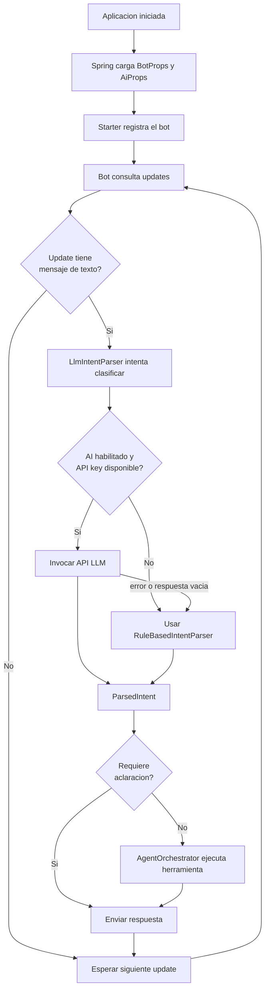
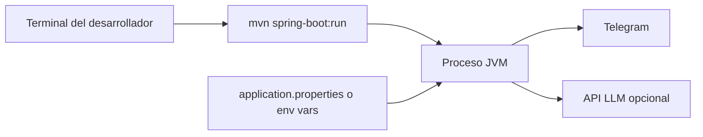
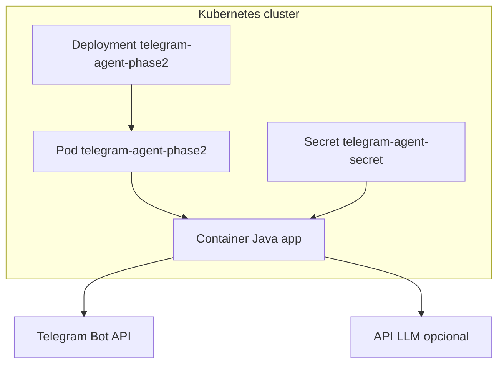

# 05. Runtime y Deployment

## Runtime actual

La app opera como bot por long polling y ejecuta un pipeline de agente sencillo:

1. recibir mensaje
2. interpretar intencion
3. decidir herramienta del dominio
4. responder al usuario

## Flujo runtime principal

## Arranque de la aplicacion

1. `SpringApplication.run(...)` crea el contexto.
2. `@EnableConfigurationProperties({BotProps.class, AiProps.class})` habilita las propiedades.
3. Spring registra `TelegramAgentBot`, `AgentOrchestrator`, parsers y servicio del workspace.
4. `InMemoryProjectWorkspaceService` ejecuta `@PostConstruct` y siembra datos demo.
5. `TelegramAgentBot` crea `OkHttpTelegramClient`.
6. El starter registra el bot y reporta `running=true` en logs si todo sale bien.

## Flujo detallado de interpretacion

### Camino con AI habilitado

- `LlmIntentParser` construye un `RestClient`.
- Envia un `system prompt` con intenciones permitidas y formato JSON esperado.
- Hace `POST` a `/chat/completions`.
- Lee `choices[0].message.content`.
- Deserializa ese contenido a `ParsedIntent`.

### Camino de fallback

- Se activa si `agent.ai.enabled=false`.
- Tambien se activa si no hay `apiKey`.
- Tambien se activa si la llamada HTTP o el parseo fallan.
- `RuleBasedIntentParser` reconoce patrones simples y regex para creacion de tareas.

## Deployment local

## Deployment Docker

### Caracteristicas

- Imagen base: `eclipse-temurin:17-jre`
- Artefacto esperado: `target/telegram-agent-phase2-0.1.0.jar`
- Entry point: `java -jar /app/app.jar`

## Deployment Kubernetes

### Componentes observados

- `Deployment` con una replica.
- `Secret` llamado `telegram-agent-secret`.
- Variables para Telegram.
- Variables para AI:
  - `AGENT_AI_ENABLED`
  - `AGENT_AI_BASE_URL`
  - `AGENT_AI_MODEL`
  - `AGENT_AI_API_KEY`

### Diagrama de despliegue en Kubernetes

## Implicaciones operativas

- No se requiere `Service`, `Ingress` ni `LoadBalancer` para la operacion del bot.
- El modo AI agrega dependencia de red hacia el proveedor LLM.
- La latencia de respuesta aumenta cuando el parser usa un modelo externo.
- El workspace se reinicia con cada restart del proceso o pod.

## Observabilidad actual

### Existe

- logging configurable por paquete
- log al registrarse el bot
- warning cuando falla el parser LLM
- error cuando falla el envio de respuesta a Telegram

### No existe aun

- metricas de intenciones
- histograma de latencia por parser
- timeouts realmente aplicados al cliente HTTP
- health checks sobre Telegram o AI
- tracing

## Escenarios de falla

| Escenario | Efecto | Mitigacion actual | Recomendacion |
|---|---|---|---|
| `TELEGRAM_BOT_TOKEN` ausente | el bot no arranca correctamente | validacion `@NotBlank` | agregar pruebas y docs de error |
| `AGENT_AI_API_KEY` ausente | no se usa AI | fallback local | esperado |
| falla del endpoint LLM | parser AI no responde | fallback local con warning | agregar metricas y timeout efectivo |
| respuesta JSON invalida del LLM | intencion no usable | fallback local | usar esquema estructurado |
| restart del pod | se pierde el workspace | ninguna | persistencia externa |
