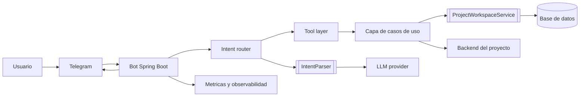

# 06. Decisiones, Riesgos y Evolucion

## Decisiones arquitectonicas principales

## Decision 1. Separar interpretacion de ejecucion

### Beneficios

- el LLM no toca directamente el dominio
- la ejecucion sigue bajo control del backend
- se puede cambiar el parser sin reescribir servicios del proyecto

### Trade-off

- agrega una capa mas y un objeto intermedio `ParsedIntent`

## Decision 2. Mantener fallback rule-based

### Beneficios

- la demo sigue funcionando sin proveedor AI
- reduce dependencia operativa externa
- permite comparar arquitectura y no solo capacidades del modelo

### Trade-off

- cobertura limitada para lenguaje natural mas complejo

## Decision 3. Usar `ProjectWorkspaceService` como puerto del dominio

### Beneficios

- define claramente las herramientas disponibles para el agente
- facilita migrar de datos demo a backend real
- mantiene al orquestador desacoplado del almacenamiento

### Trade-off

- la interfaz sigue siendo pequena y orientada al demo actual

## Decision 4. Persistencia en memoria con datos seed

### Beneficios

- onboarding rapido
- demostracion inmediata del flujo end-to-end
- evita dependencias externas

### Trade-off

- no hay durabilidad
- no hay aislamiento por usuario o chat
- no es apropiado para produccion

## Riesgos actuales

| Riesgo | Severidad | Descripcion |
|---|---|---|
| perdida de estado | alta | las tareas seed y creadas viven solo en memoria |
| inconsistencia entre replicas | alta | cada replica tendria su propio workspace |
| acoplamiento a `LlmIntentParser` | media | el orquestador no depende aun de la interfaz `IntentParser` |
| timeout no aplicado realmente | media | `AiProps.timeoutSeconds` existe, pero no se observa uso efectivo en el cliente HTTP |
| cobertura automatizada ausente | alta | no se encontro carpeta `src/test` en el proyecto |
| dependencia de prompt | media | cambios en el proveedor LLM pueden afectar el JSON esperado |

## Deuda tecnica visible

- `spring-boot-starter-web` se usa para `RestClient`, pero la aplicacion no expone una API web propia.
- `AiProps.timeoutSeconds` esta configurado, pero el parser no muestra aplicacion real del timeout.
- `LlmIntentParser` importa `Duration`, pero la logica actual no la utiliza.
- El `RuleBasedIntentParser` resuelve pocos patrones y puede quedarse corto rapido.

## Roadmap recomendado

## Fase 1. Endurecer interpretacion

- hacer que `AgentOrchestrator` dependa de `IntentParser`
- validar `ParsedIntent` antes de ejecutar acciones
- usar structured outputs o validacion JSON mas fuerte
- aplicar timeout y politicas de retry de forma explicita

## Fase 2. Sustituir el workspace demo

- implementar `RestProjectWorkspaceService` o `JpaProjectWorkspaceService`
- incorporar identificacion por `chatId`, equipo o usuario
- persistir tareas, sprints y responsables

## Fase 3. Escalar capacidades del agente

- agregar mas intenciones del dominio real
- separar handlers por intencion
- incorporar catalogo de herramientas y permisos
- registrar metricas por intencion, parser y resultado

## Fase 4. Operacion productiva

- health checks
- dashboards y alertas
- politicas de resiliencia para Telegram y AI
- trazabilidad de solicitudes

## Arquitectura objetivo sugerida

## Conclusiones

La arquitectura actual ya representa un salto claro hacia un bot-agente: separa recepcion, interpretacion y ejecucion, y ademas incorpora degradacion controlada cuando la AI no esta disponible. El siguiente paso de madurez no es solo mejorar prompts, sino profesionalizar contratos, persistencia, observabilidad y gobierno de herramientas.
