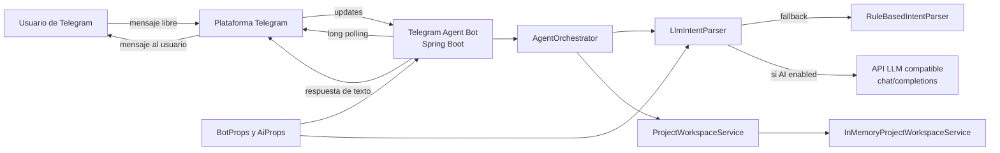

# Arquitectura C4 - Telegram Agent Phase 2

Esta carpeta documenta la arquitectura del proyecto `telegram-agent-phase2` siguiendo el modelo C4.

## Contenido

1. [01-system-context.md](./01-system-context.md)
   Vista de contexto del sistema, actores y sistemas externos.
2. [02-container.md](./02-container.md)
   Vista de contenedores logicos y de despliegue principal.
3. [03-component.md](./03-component.md)
   Vista de componentes internos de la aplicacion Spring Boot.
4. [04-code.md](./04-code.md)
   Vista de codigo, clases principales y relaciones.
5. [05-runtime-deployment.md](./05-runtime-deployment.md)
   Flujos runtime, interpretacion de intenciones y despliegue.
6. [06-decisions-risks.md](./06-decisions-risks.md)
   Decisiones arquitectonicas, trade-offs, riesgos y evolucion recomendada.

## Resumen ejecutivo

`telegram-agent-phase2` es una aplicacion Spring Boot que implementa un bot-agente de Telegram por long polling. A diferencia del starter basico, este proyecto convierte mensajes en lenguaje natural a una intencion estructurada, la valida y luego ejecuta herramientas del dominio para consultar o modificar un workspace de proyecto.

## Diagrama global

## Alcance

La documentacion refleja el comportamiento actual del codigo fuente:

- Aplicacion Java 17 con Spring Boot 3.3.5.
- Integracion con Telegram por `telegrambots-springboot-longpolling-starter`.
- Interpretacion dual de intenciones:
  - parser LLM configurable
  - parser rule-based como fallback
- Workspace del proyecto en memoria con datos seed.
- Empaquetado en jar y contenedor Docker.
- Despliegue base en Kubernetes con secretos y variables para Telegram y AI.

## Fuentes analizadas

- `pom.xml`
- `src/main/java/com/oraclebot/agentphase2/TelegramAgentPhase2Application.java`
- `src/main/java/com/oraclebot/agentphase2/config/BotProps.java`
- `src/main/java/com/oraclebot/agentphase2/config/AiProps.java`
- `src/main/java/com/oraclebot/agentphase2/bot/TelegramAgentBot.java`
- `src/main/java/com/oraclebot/agentphase2/agent/AgentOrchestrator.java`
- `src/main/java/com/oraclebot/agentphase2/agent/IntentParser.java`
- `src/main/java/com/oraclebot/agentphase2/agent/LlmIntentParser.java`
- `src/main/java/com/oraclebot/agentphase2/agent/RuleBasedIntentParser.java`
- `src/main/java/com/oraclebot/agentphase2/agent/ParsedIntent.java`
- `src/main/java/com/oraclebot/agentphase2/agent/IntentType.java`
- `src/main/java/com/oraclebot/agentphase2/service/ProjectWorkspaceService.java`
- `src/main/java/com/oraclebot/agentphase2/service/InMemoryProjectWorkspaceService.java`
- `src/main/java/com/oraclebot/agentphase2/model/TaskItem.java`
- `src/main/java/com/oraclebot/agentphase2/model/SprintInfo.java`
- `src/main/resources/application.properties.example`
- `Dockerfile`
- `k8s/deployment.yaml`
- `README.md`
